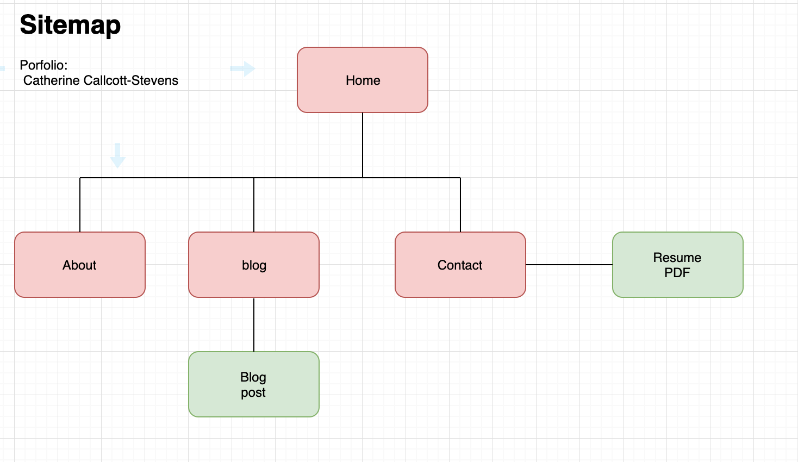
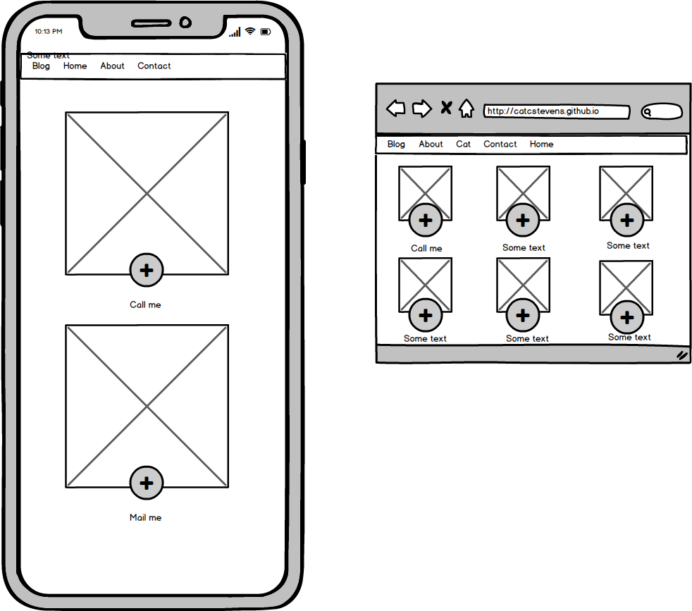
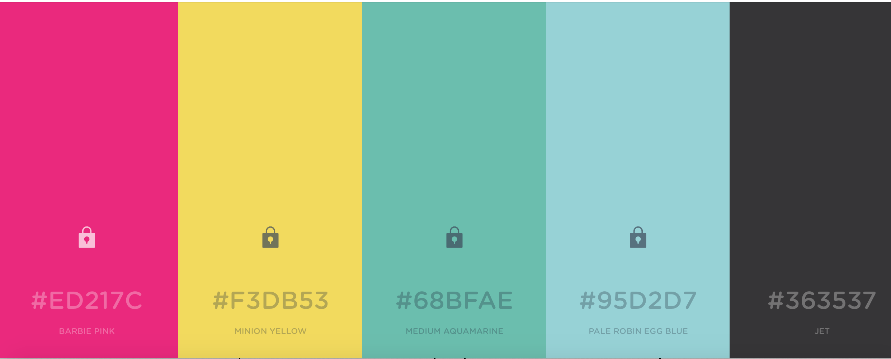

#Catherine Callcott-Stevens Portfolio#

##Link to URL##

https://catcstevens.github.io/

##Github repo##

https://github.com/catcstevens/catcstevens.github.io

##Description##
This website is a portfolio showcasing my work and experience and includes links to various social media, my resume, and contact details.

###Purpose###
The purpose of this portfolio is for prospective employers to have an interactive document that shows my experience and skills and contact details. It is like a resume with personality.

###Functionality###

This portfolio has four main pages - home, about, contact and blog. 

On the main page (index.html) there is a large "CAT" that changes colour. Under the "CAT" are three lines of text that appear one after the other. Using Flexbox, there are divs containing other elements when the homepage is scrolled down. At the bottom is a footer with links to email and social media.

The blog has excerpts of blog pages and links through a pink circle to the full blog page. Each page has a navbar with links to the other three main pages. 

Each page uses flexbox and media queries to be responsive in different screen sizes.

There are images on each page to convey a message and add to the creativity of the site. 
###Sitemap###

https://www.draw.io/#G10ZaqtvWxBPUIbwtzGje3yBIwHoDqNS5k

##Screenshots##

Wireframes

Colour picker

Moodboard

##Target Audience##
My target audience is prospective employers. I would therefore like my portfolio to show creativity and personality as well as coding skills. 

##Tech Stack##

I have used Html and CSCC with flexbox to build the site and deployed it on Github.

